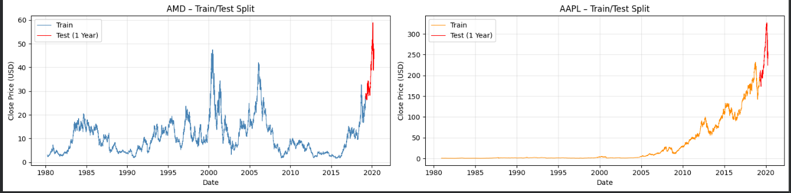
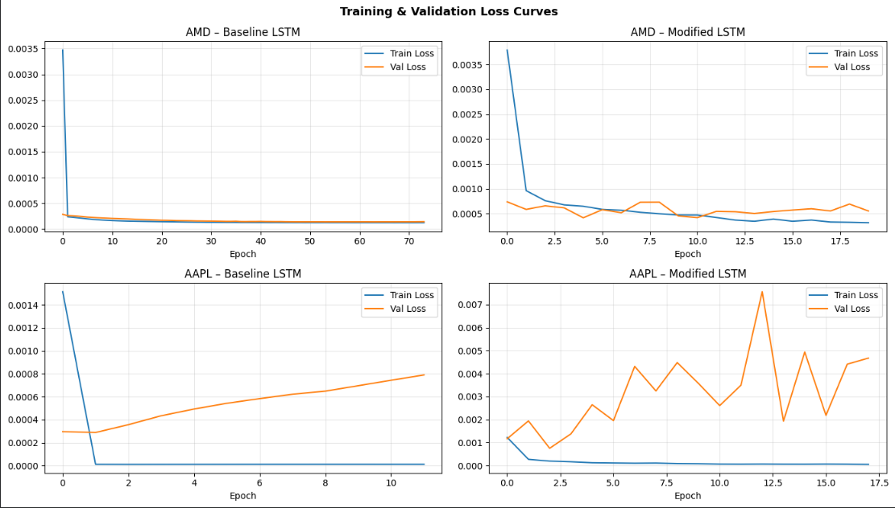
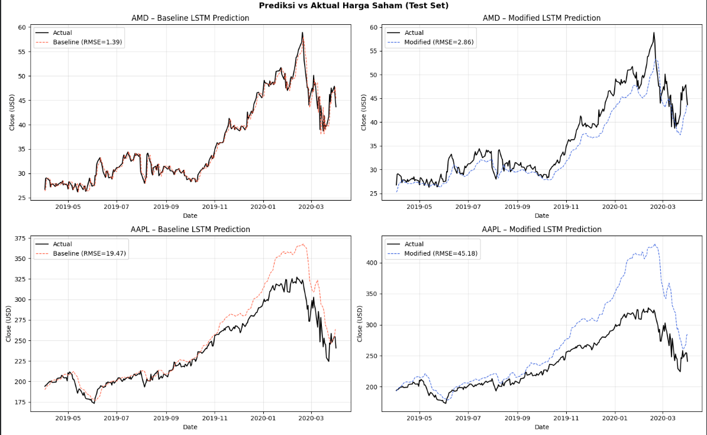

# LSTM Stock Price Prediction

A deep learning project that predicts next-day closing stock prices for AMD and AAPL using Long Short-Term Memory (LSTM) networks. Two architectures are built and compared: a single-layer baseline LSTM and a stacked LSTM with dropout regularization, evaluated on one year of held-out test data for each ticker.

---

## Overview

- **Target**: next-day closing price (`Close`)
- **Input window**: 5 trading days (Monday–Friday)
- **Prediction horizon**: 1 day ahead
- **Train/test split**: most recent 1 year held out as test set per ticker
- **Train/validation split**: remaining data split 90% train / 10% validation
- **Scaling**: MinMax scaling fit on the training set only, applied consistently to validation and test sets to avoid data leakage

---

## Architectures

### Baseline LSTM
```
LSTM(units=50, activation='relu')
Dense(units=1)
```
Optimizer: Adam · Loss: MSE

### Modified LSTM (stacked + regularized)
```
LSTM(units=64, activation='relu', return_sequences=True)
Dropout(0.2)
LSTM(units=32, activation='relu')
Dropout(0.2)
Dense(units=16, activation='relu')
Dense(units=1)
```

The modified architecture adds a second LSTM layer to capture hierarchical temporal patterns (short-term patterns in the first layer, more abstract long-term patterns in the second), and dropout to address overfitting, since the baseline is trained on 30+ years of historical data.

---

## Preview

| Train/Test Split | Loss Curves | Prediction vs Actual |
|---|---|---|
|  |  |  |

---

## Project Structure

```
lstm-stock-prediction/
├── notebook/
│   └── lstm_stock_prediction.ipynb   # Full analysis: EDA, both architectures, evaluation
├── data/
│   ├── AMD.csv
│   └── AAPL.csv
├── outputs/                          # Exported plots from the notebook
├── requirements.txt
└── README.md
```

---

## Results

| Ticker | Architecture | RMSE | MAE | MAPE |
|---|---|---|---|---|
| AMD | Baseline | 1.3926 | 0.9133 | 2.4432% |
| AMD | Modified | 2.8611 | 2.2725 | 5.8123% |
| AAPL | Baseline | 19.4709 | 12.7988 | 4.7790% |
| AAPL | Modified | 45.1782 | 31.8229 | 11.7745% |

### Interpretation

The baseline model outperformed the modified, more complex architecture on both tickers. A few likely reasons:

- **Long training history**: each dataset spans 30+ years, giving even a simple single-layer LSTM enough data to learn the underlying trend without needing extra capacity.
- **Dropout affecting early stopping**: with a shorter effective patience, the modified model may not have fully converged before training was stopped.
- **Added complexity without a matching problem**: the modified architecture's extra LSTM layer and dropout are regularization tools suited for overfitting-prone, noisier, or shorter datasets. Here, the baseline was not clearly overfitting to begin with, so the added regularization mainly reduced the model's ability to fit the signal rather than improving generalization.
- **AAPL's higher price level**: AAPL traded around USD 240–300 during the test period, considerably higher than AMD, which inflates absolute RMSE/MAE even though MAPE remains proportional and comparable across tickers.

For production use, further improvements could include an attention mechanism, hyperparameter tuning with Keras Tuner, or ensembling to push performance further. This result is also a useful reminder that architectural complexity does not guarantee better performance, and that model choice should be validated empirically against the baseline rather than assumed.

---

## Getting Started

### 1. Install dependencies
```bash
pip install -r requirements.txt
```

### 2. Run the notebook
```bash
jupyter notebook notebook/lstm_stock_prediction.ipynb
```
Make sure `data/AMD.csv` and `data/AAPL.csv` are present before running.

---

## Tech Stack

Python, TensorFlow/Keras, scikit-learn, pandas, NumPy, Matplotlib

---

## Author

**Michael Yeremia**
https://www.linkedin.com/in/michael-yeremia-3721a0360/ · https://github.com/jeraamii
